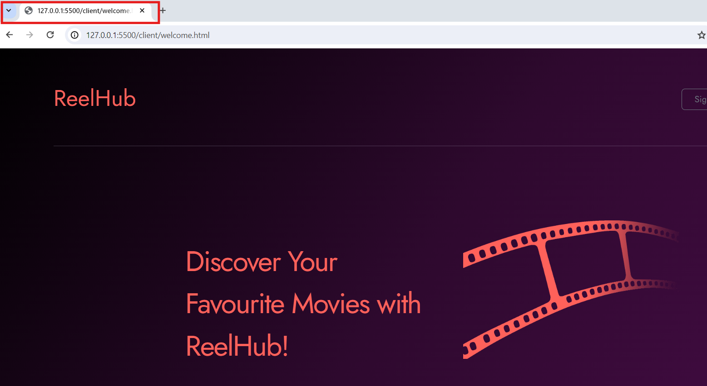
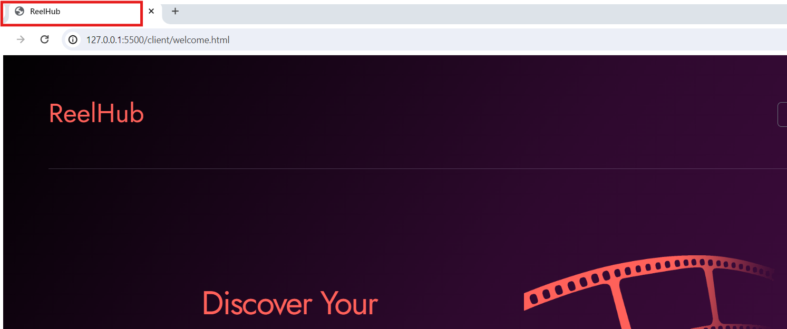
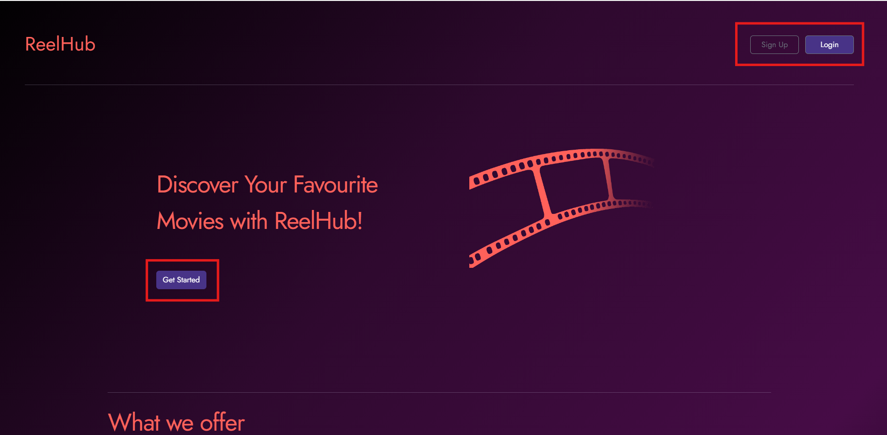
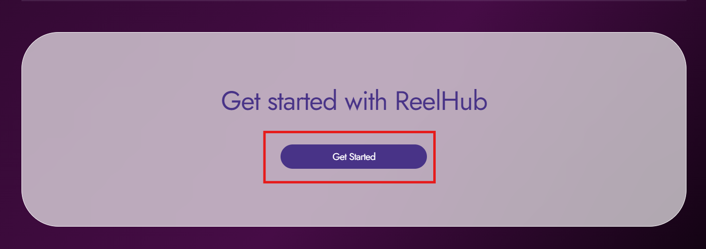
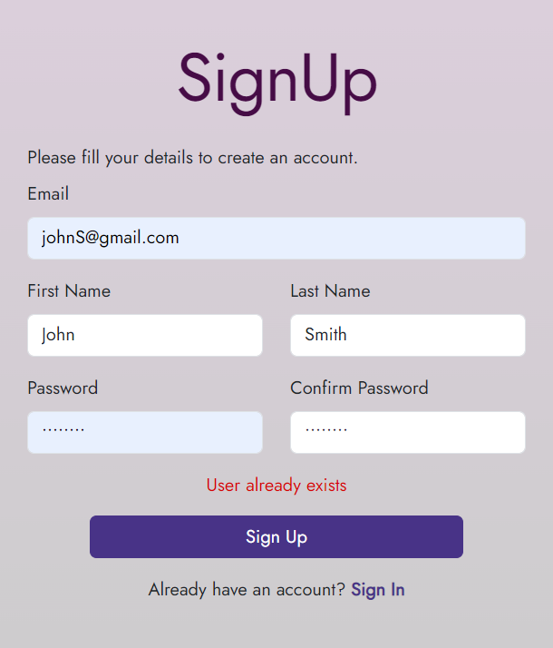

# Challenge 0

## Challenge 0.a
You need to change the title of the `landing page of the application(client/welcome.html)` to "ReelHub".

    

    

## Challenge 0.b
In the `landing page of the application(client/welcome.html)` there are some buttons which are not working. The buttons are supposed to navigate to the respective pages. The buttons are as follows:
    - `Sign Up` - This hyperlink is supposed to take the user to the sign up page(client/signup.html).
    - `Login`, `Get Started` - These hyperlink is supposed to take the user to the login page(client/login.html).

**Note - There are 2 get started button**

You need to set up these buttons to navigate to the respective pages.

    
    
    

## Challenge 0.c
In the application, more than one user cannot sign up with the same email. If a user tries to sign up with an email that already exists, the user should be shown an error message saying "User already exists".

You need to implement this in the `signup()` function in the `src/controllers/authController.js` file.

    

